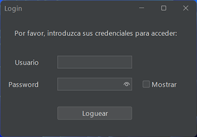
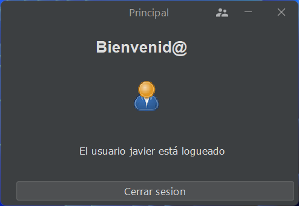
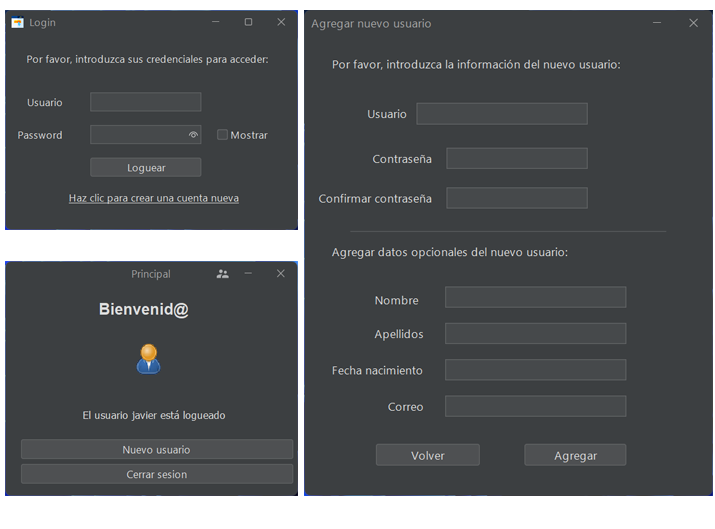

# Práctica 2.6 Pantalla de login

Esta práctica sirve como base de varios de los contenidos mínimos que debe cumplir el primer **proyecto trimestral** evaluable del módulo de Desarrollo de Interfaces.

## Parte 1

Crea una pantalla de **login** sencilla que solicite el nombre de un usuario y su contraseña; propón por el momento un listado de usuarios y contraseñas dentro del código (recuerda usar el modelo correctamente).
- Si el usuario es correcto deberá crear una nueva ventana mostrando que te has logueado mostrando el nombre del usuario y un botón que permita cerrar sesión y volver a la pantalla de logueo inicial.
- En caso contrario deberá mostrar un mensaje indicando que el logueo no ha sido correcto y volver a solicitar las credenciales.
- *Opcional*: Hacer que la ventana vibre brevemente en caso de que las credenciales sean incorrectas.

Agrega y utiliza de forma correcta las clases en los paquetes *VistaControlador* y *Modelo* para organizar las funciones de las clases de tu aplicación.

> Nota: No olvides en tus proyectos agregar los ficheros jar precompilados.

 

## Parte 2

Mejora el ejercicio anterior agregando un acceso a una **Base de Datos** sencilla que conectes mediante **JDBC**, para contener el nombre de los usuarios y sus contraseñas para realizar dicha verificación.
- Puedes utilizar como motor de la Base de Datos *Mysql*, *MariaDB* o *Derby*.
- Recuerda utilizar una **clase auxiliar** propia para crear los métodos necesarios para la BD (conectar, consultar, guardar..). Genera el código *SQL* necesario y gestiona los errores de conexión.
- Añade un botón para permitir crear **nuevos usuarios** desde la pantalla de *login*, que genere otra ventana para realizar dicha operación. En dicha ventana deberá requerirse la siguiente información:
	-  El nombre de usuario y su contraseña. Deberán de validarse.
	-  Información *opcional*: nombre, apellidos, fecha de nacimiento y correo electrónico.

> No olvides agregar la **librería** adecuada al proyecto *Ant* para la gestión de la BD.

## Parte 3

Mejorar la pantalla de **nuevo usuario** con los siguientes requerimientos:

- **Validar** que los campos opcionales no estén vacíos o mal formados antes de continuar.
- Agregar un botón para poder tener un **calendario** para seleccionar la fecha de nacimiento. Para ello deberás hacer uso de la importación de una librería externa y usar *jcalendar1.4.jar* (*JDateChooser*)
- El programa deberá verificar la creación de nuevos usuarios para evitar duplicados en la BD.
- La configuración de la base de datos deberá de leerse de un fichero *config.properties*.

Añade en la **pantalla principal** otro nuevo botón que permita **modificar la contraseña** del usuario actualmente logueado.

## Pruebas (testing)

### Parte 1 y 2

| ID Caso Prueba | Descripción Caso de Prueba                     | Entrada                                 | Salida Esperada                                                           | Resultado   |
|----------------|-----------------------------------------------|-----------------------------------------|---------------------------------------------------------------------------|-------------|
| 01             | Validaciones del botón "Loguear"               | Escribir texto en los campos Usuario y Password     | Si falta alguno de los campos no podrá continuar                  | OK/No cumple|
| 02             | Comprobación del checkbox 'Mostrar'           | Marcar/desmarcar checkbox     | Se muestra o no la contraseña con asteriscos                      | OK/No cumple|
| 03             | Conexión con la BD de datos                          | Iniciar una consulta desde la ventana   | Se conecta correctamente a la BD elegida | OK/No cumple|
| 04             | Gestión básica de la conexión con la BD de datos                          | Iniciar una consulta desde la ventana   | Se muestran y gestionan errores de conexión con la BD | OK/No cumple|
| 05             | Validación del campo usuario y password    | Escribir texto en los campos Usuario y Password     | Se valida en la BD que el usuario y contraseña existen | OK/No cumple|
| 06             | Ventana principal                     | Se abre la ventana principal al validarse el usuario/contraseña | Se muestra el nombre del usuario logueado en la ventana | OK/No cumple|
| 07             | Ventana crear nuevos usuarios                        | Hacer clic en el botón/enlace crear cuenta nueva   | Se abre una ventana de nuevos usuarios que tiene todos los campos principales y opcionales requeridos | OK/No cumple|
| 08             | Validación del campos usuario y password ventana nuevos usuarios   | Escribir texto en los campos Usuario y Password     | Se validan los campos introducidos y la contraseña duplicada | OK/No cumple|
| 09             | Estructura del proyecto                        | N/D   | Se utiliza la división por paquetes MVC; VistaControlador y Modelo para organizar las clases | OK/No cumple|
| 10             | Comprobación fichero jar                        | Proyecto a empaquetar   | Se genera y prueba el fichero jar empaquetado | OK/No cumple|
| 11             | Creación de branches                        | Parte 1 y parte 2   | Se crean al menos dos branches en el repositorio github | OK/No cumple|

### Parte 3

| ID Caso Prueba | Descripción Caso de Prueba                     | Entrada                                 | Salida Esperada                                                           | Resultado   |
|----------------|-----------------------------------------------|-----------------------------------------|---------------------------------------------------------------------------|-------------|
| 12             | Validaciones de los campos opcionales de la ventana nuevo usuario               | Texto de los diferentes campos     | Si falta texto en alguno de los campos obligatorios no podrá continuar                  | OK/No cumple|
| 13             | Agregar un componente de calendario a través de una librería JAR         | N/D     | Se muestra un calendario al hacer clic en su icono                      | OK/No cumple|
| 14             | Verificación de duplicados en la BD                          | Agregar un nuevo usuario   | Se verifica que el nombre de usuario no exista ya en la BD | OK/No cumple|
| 15             | Leer datos de la BD de un fichero llamado config.properties                          | N/D   | Se leen los datos de conexión de la BD de dicho fichero y no del código fuente | OK/No cumple|

