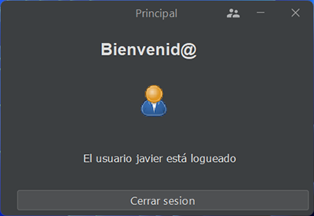

# Práctica 2.6 Pantalla de login

## Parte 1

Crea una pantalla de **login** sencilla que solicite el nombre de un usuario y su contraseña; propón por el momento un listado de usuarios y contraseñas dentro del código (recuerda usar el modelo correctamente).
- Si el usuario es correcto deberá crear una nueva ventana mostrando que te has logueado mostrando el nombre del usuario y un botón que permita cerrar sesión y volver a la pantalla de logueo inicial.
- En caso contrario deberá mostrar un mensaje indicando que el logueo no ha sido correcto y volver a solicitar las credenciales.
- *Opcional*: Hacer que la ventana vibre brevemente en caso de que las credenciales sean incorrectas.

 

## Parte 2

Mejora el ejercicio anterior agregando un acceso a una **Base de Datos** sencilla que crees, para contener el nombre de los usuarios y sus contraseñas para realizar dicha verificación.
- Puedes utilizar como motor de la Base de Datos *Mysql* o *Derby*.
-  Utiliza una **clase auxiliar** para crear los métodos necesarios para la BD (conectar, consultar, guardar..). Genera el código *SQL* necesario y gestiona los errores de conexión.
- Añade un botón para permitir crear **nuevos usuarios** desde la pantalla de *login*, que genere otra ventana para realizar dicha operación. En dicha ventana deberá requerirse la siguiente información:
	-  El nombre de usuario y su contraseña.
	-  Información *opcional*: nombre, apellidos, fecha de nacimiento y correo electrónico.

No olvides agregar la **librería** adecuada al proyecto Ant para la gestión de la BD.

## Parte 3

Mejorar la pantalla de **nuevo usuario** con los siguientes requerimientos:
- **Validar** que los campos no estén vacíos o mal formados antes de continuar.
- Agregar un botón para poder tener un **calendario** para seleccionar la fecha de nacimiento. Para ello deberás hacer uso de la importación de una librería externa y usar *jcalendar1.4.jar* (*JDateChooser*)
- El programa deberá verificar la creación de nuevos usuarios para evitar duplicados en la BD.

Añade en la **pantalla principal** un nuevo botón que permita modificar la contraseña del usuario actualmente logueado.

